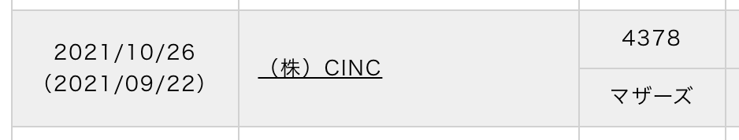

# 2021-09
## 技術関連:computer:
### 【Work】
* 半年前に作ったLambdaのデプロイフローのリプレイス
    * Docker, ECR, Bitbucket Pipelinesを利用
* 大規模な障害の対応（SSLに関する）
* 弊社の東京証券取引所マザーズへの新規上場が承認!! 
* Swaggerの導入における調査
* 新機能のAPI設計

### 【Priv】
* UdemyのReact+golangの講座 
⇒ [Working with React and Go (Golang)](https://www.udemy.com/course/working-with-react-and-go-golang/)
* 冷蔵庫を購入
* 引っ越しを取りやめ
* ワクチン2回目done
* ジムを再開
* 食事の[メニュー](https://www.evernote.com/shard/s440/sh/95416d4e-7ddb-c97f-3947-cd829a664503/b773315eee2bff8aa866a24ba9260391)を作成し管理
* [`みんちゃれ`](https://minchalle.com/)により朝活やGitHubへのコミットが習慣化
* 痔になって2週間廃人のような生活

## 読書:books:
* [『入社3年塾』赤羽雄二](../Storage/book_入社3年塾.md)

## 振り返り:eyes:
* **半年前に作ったLambdaのデプロイフローのリプレイスを行った** 
∟ 半年前に作った時はデプロイフローは複雑だが全てドキュメント化しており問題ないと考えていた。しかし実際に他の人がデプロイを行う際に完全に伝わり切らず、、デプロイフローはシンプルであることの方が余程重要なのだと気付かされた。 
⇒ 第一にシンプル化を考えて、デプロイの行いやすさもリリースの判断基準にしても良い

* **バックエンドに続きフロントのこともかなり理解が進んだが、実際にアプリを作る際にそこを繋ぎこむミドルウェアの知識があまり無いことが分かった。** 
∟ 事業会社に入ると新規プロダクトの立ち上げに関わらない限り、アプリの基幹部分に触れることが無いため、そこはSIerのような受託会社の方が経験が積めるんだなとも思った。とはいえプライベートで十分に補える知見なので必要なら勉強するだけです。 
⇒ サブネット・SSL・ミドルウェアといったインフラ部分ではあるものの、非常にバックエンドと近しい部分の知見を補う

## 所感:clap:
今月最も影響度があったものは[`みんちゃれ`](https://minchalle.com/)を開始したことにより朝活やGitHubへのコミットが習慣化したこと。ちょこちょこしか進められていなかったUdemyの講座もグングン進むようになった。 

ブルーピリオドの1節に『自主制作を進められる人は強い』といった言葉があったが、その通りである一方であの漫画では”環境”や”性格”といった要因が強く再現できるものでは無いと思われる。 

個人的にこの状態にするために下記が重要だと改めて思った 
”「やるべき理由の腹落ち度」×「それを継続させる仕組み」” 
そういった意味で[`みんちゃれ`](https://minchalle.com/)はある意味で最強だったかな 

といったところで成長できる仕組みを改めて整えられた、とても意味のある月だった